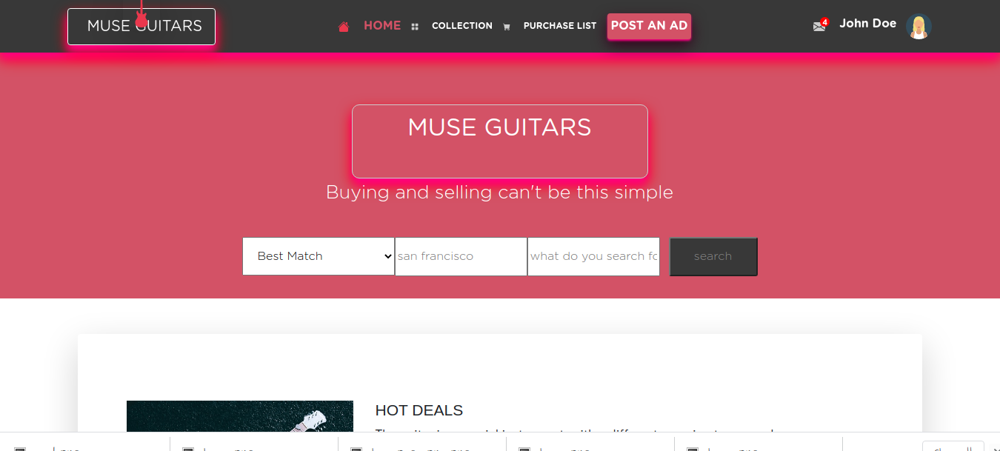

# HTML & CSS Capstone Project

# An Online Shop For Musical Instrument

 This is an HTML & CSS Capstone Project,a real-world-like project, built with business specifications. A given design of a website was followed with specifications, but content was personalised. I have picked a musical instrument online shop for a more unique project the main reasons why I have chosen this project is to exercise my love for music and choosing this will be a great way to exploring the business aspect of it. A great way of making people have easy acces to the type of musical instrument they crave to buy, I aim at solving the problem of searching for a near by shop in town which you mayn't have an idea of, but just surfing through this little cart all you want is at your finger tip .
 For the route, click on the "collection link on the nav bar" for the next page.
 ## Contributing to the HTML & CSS Capstone Project
 
 To contribute to the HTML & CSS Capstone Project, follow this steps:
 
 ---
 
 - Fork this reprository.
 - Create a branch:git checkout -b <branch_name>.
 - Make your changes and commit them : git commit -m '<commit message>'
 - Push to the original branch: git push origin capstone_HTML_CSS/feature.
 - Create the pull request.
 
 
 
 
## Built With

- HTML5
- CSS3
- BOOTSTRAP

## Live Demo

Live project [Muse Guitars](https://rawcdn.githack.com/ignatius22/capstone_html_css/8618821e738a2106b4c3b9d3101c32435a08d7b2/index.html)

## Authors

👤 **Ignatius Sani**

- Github: [ignatius22](https://github.com/ignatius22)
- Twitter: [@Iggy_code](https://twitter.com/iggy_code)
- Linkedin: [linkedin](https://www.linkedin.com/in/ignatiussani)

## 🤝 Contributing

Contributions, issues and feature requests are welcome!

Feel free to check the <a href="https://github.com/ignatius22/capstone_html_css" target="_blank">issues page</a>.

## Show your support

Give a ⭐️ if you like this project!

## Acknowledgments
 
- <a href="https://www.microverse.org/" target="_blank">Microverse</a>